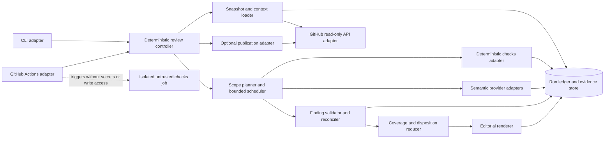

# PR Review Harness architecture

Status: proposed target architecture for specification and implementation planning. No decision authority has accepted these proposals. The only confirmed delivery choice is a CLI with GitHub Actions integration, piloted against magnus919/SlopSearX. Repository-specific conventions, GitHub configuration, credentials, model endpoints, and operating limits remain subject to read-only discovery and verification.

## Drivers and evidence

The harness should provide reusable, risk-sensitive PR review behavior while preserving a clear human decision boundary. Deterministic software owns sequencing, scope, budgets, retries, escalation, termination, and effects. Models may return bounded semantic assessments or candidate findings, but may not choose actions or tools. Review output must preserve evidence and gaps, and distinguish review disposition from merge eligibility.

The research memo supports explicit security review lenses, contextual review, and conservative treatment of static-analysis alerts. It does not demonstrate that this harness, a provider, GLiNER, Laya, or Jev can find blockers at an acceptable rate. Read-only pilot discovery observed repository-secret metadata named `DEEPSEEK_API_KEY`, `FACTORY_API_KEY`, and `GPUSLUT_API_KEY`; no named Nous or Typesafe secret appeared. The existing Droid workflow routes the `general` alias through a GPUSLUT-authenticated OpenAI-like endpoint; the backend is unverified. Jev CI uses empty or synthetic key values and is not evidence of live inference credentials. Secret values were not accessed. All provider/checkpoint/runtime contracts, quality thresholds, and illustrative resource limits remain proposals pending verification and stakeholder selection.

## Architecture scenarios

| Priority | Scenario | Required response |
|---|---|---|
| Must preserve | A PR changes its head while a run is in progress. | Mark freshness STALE, prevent publication, preserve the result for diagnosis, and require a fresh run for a current review. |
| Must preserve | PR-controlled text or code contains instructions to expose credentials or change review policy. | Treat it as evidence only; trusted policy, credentials, tool permissions, and state transitions remain unchanged. Never execute PR code in the credentialed analysis boundary. |
| Must preserve | A worker times out, returns malformed data, or an essential provider is unavailable. | Apply bounded deterministic retries; record the failed scope and missing coverage; do not infer success or APPROVE from absence. |
| Must preserve | The run exhausts a deadline, call budget, or context budget. | Stop dispatching, persist known evidence, mark uncovered required scope PARTIAL, and reduce disposition using the incomplete ledger. |
| Must preserve | Editorial synthesis rewrites or omits a reconciled blocker. | Final output retains every accepted blocker ID and evidence link; synthesis cannot change acceptance or disposition. |
| Enabling | The same review behavior is invoked locally or from GitHub Actions. | Both adapters call the same versioned core contracts and reducer. |
| Enabling | The pilot is read-only. | Produce a durable local/CI report and ledger; no review comment, label, check-run conclusion, merge, or code write occurs. |

These scenarios are qualitative design requirements, not measured service-level objectives. Deadline and cost values, concurrent scope counts, and retry counts require pilot configuration and observed evidence.

## Chosen shape

Use a local modular core packaged behind a CLI, with a thin GitHub Actions adapter for input discovery and artifact delivery. The controller runs as one process and owns a durable per-run ledger. Provider, repository-context, deterministic-check, and GitHub APIs are ports behind narrow adapters. This topology supports a usable local path and workflow reuse without making a hosted service, queue, database, or independently deployed workers prerequisite to the first pilot.

Bounded parallelism is an internal scheduler feature: independently scoped review tasks may run concurrently up to the configured finite limit. A single coordinator owns ordering, budget reservations, retries, state transitions, and reduction. Workers cannot create work, increase budgets, change policy, or publish effects.

## Proposed deterministic mode and scope routing

The trusted, versioned profile defines required lenses and risk floors. The controller uses observable features; an unknown feature never lowers a floor. These rules are proposals to validate with the pilot, not calibrated thresholds:

| Evidence at intake or during review | Minimum action |
|---|---|
| Only prose/documentation changes with no executable examples, policy effect, or generated-code relationship | LIGHT may cover changed prose and linked policy/context. Do not route semantic code/security lenses solely because the diff has many lines. |
| Any authentication, authorization, permission, trust-boundary, secret-handling, input-validation, or policy-gate change | At least FOCUSED; require the relevant security/correctness lens, inspect the called policy/control boundary and tests, and escalate to DEEP if impact or enforcement remains uncertain. A one-line authorization change meets this floor. |
| Concurrency, persistence/replay, cache/cursor, transaction, external side effect, or public API/wire-contract change | At least FOCUSED for affected callers, state owner, failure/recovery path, and contract tests; DEEP when data loss, privilege, or broad compatibility consequences are plausible. |
| Large or cross-cutting change, multiple critical subsystems, or high-impact findings/context gaps | DEEP subject to configured finite budget; if the budget cannot cover required work, report PARTIAL/INCOMPLETE or REQUEST_CHANGES when a substantiated blocker exists. |
| Generated or vendored change | Determine generated status only from trusted profile/provenance. Review generator/source and provenance; if unknown, treat as ordinary changed code and mark provenance uncertainty. Never skip solely because a PR labels files generated. |
| Missing caller, contract, test, configuration, or trust-boundary context | Emit a typed context-gap proposal; controller retrieves only through configured bounded sources. If still missing, retain the gap, preserve required lens, and prohibit APPROVE. Unknown context cannot downgrade mode. |
| Optional System One assessment returns supported evidence | A deterministic validator checks the answer against the fixed question, cited evidence, native contract, and allowed labels. This may inform reconciliation but does not establish truth, confidence calibration, or permission to take a new action. |
| System One assessment is assigned to a required obligation and returns unsupported, contradicted, uncertain, malformed, or times out | Do not convert to a negative finding or clear coverage. Retry only within limits; otherwise record unresolved/failed scope and that required obligation as PARTIAL. A critical unresolved lens prevents APPROVE. |
| A redundant/optional provider or assessment fails after required obligations are satisfied | Preserve the failure in provenance, but do not shrink COMPLETE required coverage or alter disposition solely due to the optional failure. |

The provider-free baseline is an explicit supported operation when trusted configuration permits it. It runs deterministic inventory/checks and any non-provider tasks, records provider-dependent semantic scopes as NOT_STARTED, and cannot produce APPROVE while required semantic coverage is missing. A profile that requires a configured provider rejects preflight when the request omits it. LOC may estimate workload but never independently selects risk mode or proves review quality.

### C4 component view

Audience: implementers and reviewers deciding whether module ownership and trust boundaries are clear. Question: which component owns policy, evidence, inference, execution, and publication? This is a proposed logical component view; runtime deployment depends on project discovery.

### Module ownership and coupling

| Module | Owns | Must not own |
|---|---|---|
| CLI / Actions adapters | Parse invocation, identify event, supply configuration references, invoke core, expose output artifact/status. | Review policy, model decisions, or independent disposition rules. |
| Snapshot/context loader | Immutable base/head identity, changed-file inventory, bounded trusted context retrieval, provenance and freshness observations. | Treat PR content as trusted policy or execute it. |
| Controller and scheduler | State machine, deterministic stage ordering, bounded parallelism, context-fetch priorities, deadline/cost/call reservations, retries, escalation, termination, checkpointing. | Model-authored next steps or unbounded retries. |
| Project profile | Trusted, versioned repository conventions, risk floors, context maps, allowed deterministic checks, limits, and optional model capability requirements. | PR-supplied policy overrides. |
| Check adapters | Execute approved deterministic inspections; separate safe static/read-only checks from code execution. | Credentials in untrusted test jobs or changing controller state except typed results. |
| Provider adapters | Translate one documented native provider contract to bounded semantic questions; redact credentials and record model/runtime provenance. | Workflow control, arbitrary tool use, or claiming semantic equivalence across providers. |
| Finding validator/reconciler | Schema/type validation, location and snapshot checks, evidence linkage, duplicate/correlation grouping, contradiction tracking, acceptance status. | Silently accept unsupported claims or discard blockers. |
| Reducer and editorial renderer | Deterministic disposition from reconciled evidence and coverage; four report sections and explanation. | Model override of reducer, fabricated strengths, or omission of accepted blocker IDs. |
| Ledger / evidence store | Durable source of run state, immutable inputs and outputs, append-only transitions, recovery checkpoints, idempotency keys. | Becoming a second policy authority or retaining credentials. |
| Optional publisher | Explicitly enabled, least-privilege, idempotent GitHub effect tied to current head and report hash. | Auto-merge, source edits, or publication of stale/unreviewed output. |

The core owns the contract and state transitions; adapters own vendor or platform translation. Shared durable state remains under the controller's ownership. This avoids a distributed transaction between scheduler, findings, and disposition. Do not split modules into services until independent scale, security isolation, ownership, or availability evidence justifies the added deployment and recovery coupling.

## Runtime and recovery

A run receives a stable `run_id`; its immutable review snapshot receives `snapshot_id` and records `base_sha`, `head_sha`, event identity, repository identity, and `project_profile_version`. Inputs and each transition are appended to the ledger before the next externally visible stage. The controller can resume only from validated checkpoints whose run, snapshot, profile version, and contracts match. A mismatched or corrupt checkpoint fails closed as INCOMPLETE and starts no publication.

The controller uses an explicit finite state machine: `RECEIVED → PREFLIGHTED → SNAPSHOTTED → PLANNED → DISPATCHING ↔ RECONCILING → REDUCED → RENDERED → COMPLETE`. Any nonterminal state may enter `INCOMPLETE`; head mismatch sets freshness STALE and bars publication. Preflight configuration errors enter `REJECTED` atomically before any worker dispatch. Cancellation and deadline exhaustion persist the ledger and end INCOMPLETE. Terminal states are immutable; reruns use a new `run_id`, while idempotent resume reuses the existing one.

| Failure | Deterministic handling |
|---|---|
| Worker timeout / transient provider failure | Retry only the same idempotent task within its attempt and run budgets; persist each attempt. On exhaustion mark that scope failed and continue other required scopes only while budget remains. |
| Malformed or unsupported provider response | Reject that response; do not coerce, truncate, or infer missing fields. Record the task as invalid/failed and apply configured bounded retry. |
| Unknown configured provider or unsupported model primitive | Reject the whole request during preflight, before snapshot work that may dispatch inference, worker creation, or external effects. No implicit provider substitution. |
| Budget/deadline exhausted | Stop new work, allow only bounded in-flight completion/grace, checkpoint, mark remaining scopes NOT_STARTED or failed, then reduce with PARTIAL coverage. |
| Duplicate delivery / process restart | Deduplicate by `run_id` and task idempotency key; reload last committed transition and resume safely. Duplicate results with identical task/output hashes are no-ops; conflicting outputs are quarantined and reconciled as ambiguity. |
| Head changed during review | Mark STALE, finish evidence capture if safe, prohibit publication, expose the observed and expected SHAs, and require a new run for a current result. |
| Ledger write or integrity failure | Stop work and effects. Report INCOMPLETE if a trustworthy report can be formed from durable state; otherwise report run failure without claiming coverage. |
| Publisher timeout / ambiguous response | Query by stable publication idempotency key and reconcile remote state before retry; never blindly create a duplicate. Publishing stays disabled in the initial pilot. |

An optional publisher must re-fetch the PR head immediately before effect and bind the effect key to repository, PR number, head SHA, disposition, and canonical report hash. If any binding differs, it rejects the effect. Publication outcome is recorded separately from review completion. No merge operation exists in the initial interface.

## Trust and isolation

Treat diffs, PR title/body/comments, filenames, commit messages, generated files, and worker outputs as untrusted. The trusted project profile is loaded from a trusted base/release source and versioned; head-controlled content can provide evidence but cannot rewrite instructions, scopes, budgets, allowed commands, or secrets policy. Escape/sanitize all external text for logs and shell/API boundaries.

The credentialed analysis path reads PR metadata and Git objects and sends bounded evidence to configured analysis providers. It never executes head-controlled code, tests, package hooks, build scripts, or generated executables. Provider credentials are available only to the transport adapter, excluded from prompts, task payloads, reports, crash dumps, and logs, and granted minimum read scope. The analysis process exposes no general-purpose tools to a model.

Any head-code tests or build checks run in a separate disposable sandbox with no secrets, no write-capable token, no shared writable cache, and bounded CPU, memory, process count, filesystem, network, and time. Results cross back as typed, size-limited data with provenance. GitHub Actions integration must use least-privilege permissions, pinned action revisions, and event design that prevents an untrusted PR from reaching secrets or write tokens. Exact workflow settings are implementation work and require repository discovery.

## Disposition, coverage, and merge eligibility

`coverage_state`, `freshness`, `disposition`, and `merge_eligibility` are independent fields. Complete coverage can still produce REQUEST_CHANGES; partial coverage can contain a substantiated blocker; stale coverage cannot be presented as current. APPROVE is ineligible whenever freshness is not CURRENT, any required coverage is incomplete, a required lens is unknown, or an accepted blocker exists. The detailed reducer contract belongs in CONTRACTS.md. Merge eligibility is `NOT_EVALUATED` unless the integration explicitly evaluates configured branch protections and required checks; even then the harness reports eligibility evidence and has no merge authority.

Editorial output always has exactly four top-level categories: Blockers, Suggested improvements, Specific strengths, and Future guidance. It preserves every accepted blocker by stable finding ID. Optional categories may be empty and must not acquire invented positives. Editorial prose may clarify but cannot change evidence, finding status, severity, coverage, or disposition.

## Alternatives and evolution

| Alternative | Why deferred |
|---|---|
| Separate hosted orchestration service, worker fleet, and database | No confirmed multi-tenant workload, independent scaling need, or operations owner; adds deployment, consistency, identity, and recovery surfaces before the first usable pilot. Reconsider if measured concurrency or durability needs exceed a local process and durable artifact store. |
| GitHub Actions-only implementation | Makes local use and cross-host reuse harder and entangles review policy with workflow YAML. Actions should adapt events and credentials into the reusable CLI/core. |
| Prompt-driven agent that chooses stages/tools | Conflicts with the requirement that control flow, budgets, and effects remain deterministic; creates unbounded authority and irreproducible behavior. |
| One monolithic prompt/model call | Cannot independently scope parallel lenses, enforce per-scope coverage, reconcile evidence, or reliably preserve blockers under a deterministic reducer. |
| Immediate distributed queue / event choreography | No independent owners or workload shape are established; orchestration in one controller makes bounded progress, budgets, and recovery legible. |

Evolution sequence: (1) local read-only CLI against an immutable repository snapshot and trusted profile; (2) SlopSearX GitHub Actions invocation with read-only metadata/context and report artifact, after names-only verification of configured secret references; (3) isolated untrusted checks; (4) optional publication only after explicit product authorization, idempotency and head guards, permissions review, and failure exercises; (5) consider service decomposition only when observed workload and ownership support it. This is a proposed sequence, not implementation evidence or approval.

## Open evidence and decision owners

- Product owner: choose pilot success measures, acceptable incompleteness, posting mode, failure tolerance, and whether any later effect is authorized.
- SlopSearX maintainers: confirm trusted profile inputs, current checks/conventions, workflow/event constraints, and any required credential binding by names/metadata only. Existing Droid routing is evidence of a GPUSLUT endpoint configuration, not proof of a Nous backend; the asserted Nous and Typesafe/Jev credential expectations remain unverified. Never inspect values.
- Provider/runtime owner: identify actual endpoint/checkpoint/API semantics, native structured-output and timeout behavior, privacy/retention, cost accounting, and supported primitives. No provider is assumed equivalent to another.
- Architecture owner: review this proposal and its ADRs; acceptance is currently unresolved.
- Evaluation owner: establish representative human-adjudicated cases and sponsor-selected error/abstention bounds before any quality-based release or replacement gate is claimed. Human labels do not block a separate owner-authorized read-only advisory shadow/canary that passes the deterministic operational checks and leaves the incumbent reviewer authoritative; this path makes no quality claim.
